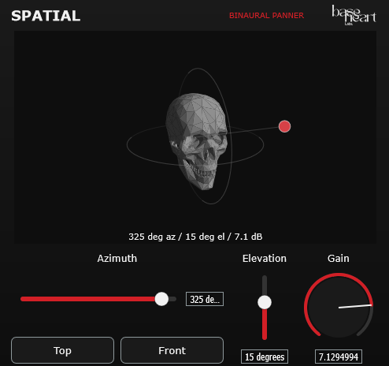

# Spatial Audio Plugin

A binaural panner plugin built with the JUCE framework. It treats the input as a single point source and places it anywhere around the listener using a set of head-related impulse responses (HRIRs). An interactive 3D view is used to set and visualise azimuth and elevation, with output gain driving the source's apparent distance.

Built as a VST3 and standalone app for Windows. **Intended for headphone listening.**



| Parameter | Range | Notes |
|---|---|---|
| Azimuth | 0-359 deg | 0 is straight ahead, increasing clockwise |
| Elevation | -90-90 deg | 0 is level, +90 is above, -90 is below |
| Output Gain | +/-12 dB | Drives source distance in the visualiser |

---

## Background

### Head Related Impulse Response (HRIR)

When you hear a sound from a certain direction, your head, torso, and outer ear all transform the
signal of that sound before it is perceived by your brain. The transform applied is different for each
person, and can vary based on the direction the sound has come from. Estimates have been made of these
transforms using dummy heads that "average" human head and body shape; the resulting measurements are
called head-related impulse responses, or HRIRs. Each one is captured by playing an impulse from a
given direction relative to the dummy head and recording the response at a microphone in each of its
ears.

That measurement can be decomposed into three main cues our brain uses to localise sound:

- **Interaural Time Difference (ITD)**- The difference in arrival time between the nearer ear and the further one.
- **Interaural Level Difference (ILD)**- The difference in level between the nearer ear and the further one, caused by the head shadowing the far ear.
- **Spectral Shaping from the Pinnae**- The direction-dependent pattern of peaks and notches that the folds of the outer ear impose on the spectrum. This resolves what ITD and ILD cannot: elevation, and front-versus-back.

We can use these measurements by convolving them with a mono source, projecting our source in space based on the location associated with the measurement.

### Convolution

For each output sample, per ear:

```
y[n] = sum(k = 0 .. N-1) of  h[k] * x[n - k]
```

`h` is the measured impulse response for the current direction, `x` is the mono input history, and
`N` is the number of taps, taken from the dataset at load time- 256 for these measurements. That is
256 multiply-accumulates per ear, so 512 per input sample (~24.6 million per second at 48 kHz).
`x[n-k]` is pulled from a circular history buffer the length of the HRIR.

---

## Design Decisions

### Direct-form FIR instead of partitioned FFT convolution

The first implementation used `juce::dsp::Convolution`, which performs partitioned FFT convolution.
However, upon reviewing the JUCE documentation, that class is built for very long impulse responses -
reverb measurements, for example- where the  `O(log N)` cost per output sample of partitioned
FFT convolution beats direct convolution's `O(N)`.

The HRIRs used here are 256 taps. At that length direct convolution is already cheap, so the partitioning
bought nothing and cost a great deal of complexity, namely:

- `loadImpulseResponse()` was an asynchronous function used to hand the work to a background thread. 
  The plugin had no way to know when the new response was actually live, so a fast position change *could*
  crossfade into a convolver still holding the previous IR.
- Working around that required a debounce before any load, which added audible lag to every
  movement.
- Two convolver instances had to run in parallel at all times so one could be swapped while the other
  played, doubling the convolution cost permanently.

Replacing it with a direct FIR deleted the async path, the debounce, the double-convolver toggle,
the race condition, and lowered CPU use.

**Takeaway: match the algorithm to the problem size.** FFT convolution is not universally better; it
wins only past a length threshold, and below it you pay in latency and complexity.

### Crossfading > Interpolation

Swapping IR taps instantaneously produces a discontinuity in the output (clicks and pops). To smooth the
transition, there are two options:

1. **Interpolate Coefficients**- blend the two IRs sample-by-sample into one filter.
2. **Crossfade Outputs**- run both filters on the same input and fade between their results.

This plugin implements option 2, crossfading over 10 ms. Option 1 is tempting because it is cheaper,
but it is wrong here: HRIRs from different directions have different ITDs, so their impulse peaks sit
at different delays. Blending them produces a filter with two offset peaks (effectively a comb
filter) which sounds hollow and phasey.

Crossfading outputs costs double during the fade (1,024 multiply-accumulates per sample rather than
512), which is acceptable for a 10 ms window.

### No Per-IR Normalisation

The raw measured responses peak around -90 dBFS, which initially made the output volume very low.

The first fix tried, `juce::dsp::Convolution::Normalise::yes`, is wrong here for two reasons:

- It normalises by the L1 norm (the sum of absolute sample values), a worst-case bound assuming an
  input that aligns perfectly with the filter. Real broadband material never does, so oscillating
  responses like HRIRs end up heavily over-attenuated.
- More importantly, it normalises each IR independently. Interaural level difference is one of the
  three localisation cues- the whole point is that a source on your left *should* be quieter in your
  right ear. Normalising per-direction flattens exactly the information the plugin exists to
  reproduce.

So the raw taps are used and one fixed makeup gain is applied globally, preserving all level
relationships between positions and between ears. That constant is currently hand-tuned; deriving it
from the dataset's global peak is a change that could be introduced in the next iteration.

### Nearest-Neighbour Direction Selection

The dataset is measured across a set of discrete azimuth and elevation values. The plugin snaps to the nearest available values rather than interpolating between measurements.

This is a deliberate simplification. Proper interpolation between HRIRs requires time-aligning them
first (see the comb filtering problem above), and snapping is far simpler. The audible cost is small
because azimuth resolution is 1 degree, which sits right at the ~1 degree localisation blur of human
hearing directly ahead and well inside it toward the sides, where that blur widens to 10 degrees or
more- so horizontal movement sounds continuous. Elevation uses 17 rings, which is coarser and where
stepping is most likely to show, though in my listening tests it was not especially obvious.

### Decode Once, Index Forever

All impulse responses are decoded from WAV into a flat float table at construction. After that, moving
the source only changes which offset into that table the filter reads from- no decoding, no
allocation, no file access, and no locking on the audio thread.

Further, the table is indexed arithmetically (`elevationIndex * 360 + azimuth`) rather than through a map, so
lookup is a single multiply-add rather than a tree traversal.

Trade-off: about 12.5 MB of floats (6,120 directions x 2 ears x 256 taps x 4 bytes), allocated per
plugin instance.

### Coordinate Conventions

SADIE measures azimuth **anti-clockwise** from straight ahead. This plugin presents azimuth as
clockwise, which is the more common convention in panning UIs. `HrtfConvolver::indexFor()` converts
between them with `(360 - azimuth) % 360`.

Elevation is stored as 0..180 rather than -90..+90 so the host sees a simple positive integer range;
the UI subtracts 90 for display.

---

## The Visualiser

A simple 3D renderer is used here (I leaned a lot on Claude to help me wire up this part 😊). It exists because a binaural panner is hard to operate without seeing where the source is. This was a good learning experience as someone who hasn't implemented many UIs before. I got to take a look at creating custom assets in Blender and Figma, as well as programatically through the JUCE framework.

---

## Lessons learned

Bugs this project produced, and what they taught:

**Collapse the Signal to Mono.** An HRIR pair is two filters applied to one source- it is not a
stereo-in/stereo-out matrix. Feeding a stereo signal in and convolving left-with-left-IR and
right-with-right-IR does not spatialise anything- it applies two mismatched filters to two unrelated
signals. The result is filtered, so it sounds like *something* is happening, but it is incorrect. The
correct approach is to use one source signal and convolve it against both ear responses. The plugin
therefore sums the input to mono first, then renders that single source to a stereo pair.

**Asynchronous APIs Need Explicit Completion Handling.** The double-convolver crossfade assumed
`loadImpulseResponse()` was synchronous. It is not. Either wait for confirmation or pick a synchronous
design- do not assume.

**Validate Input, Not Just Output.** `isBusesLayoutSupported()` only checked the output
bus while `processBlock` unconditionally read `getReadPointer(1)`. A host negotiating mono input would
have caused an out-of-bounds read.

---

## Building

Built with the Projucer, not CMake.

1. Open [SpatialAudioPlugin.jucer](SpatialAudioPlugin.jucer) in the
   [Projucer](https://juce.com/discover/projucer) and save it. That regenerates `JuceLibraryCode/`
   and an exporter for your platform under `Builds/`. Neither directory is checked in - both are
   generated, and both bake in machine-specific JUCE module paths.
2. Open the generated project and build the **Standalone** or **VST3** target.

Requires a local JUCE install. If the module paths in the `.jucer` don't match yours, re-save from the
Projucer to regenerate them.

## Layout

```
Source/
  PluginProcessor.*      audio processor, parameter wiring, gain stage
  HrtfConvolver.*        HRIR table decode + direct-form FIR renderer
  Parameters.*           parameter IDs, ranges and value formatting
  PluginEditor.*         editor layout, header, view preset buttons
  SpatialVisualizer.*    3D scene: camera, projection, shading, interaction
  HeadMesh.*             OBJ parser, decimation, normalisation
  LabeledSlider.*        titled slider used for all three controls
  SpatialLookAndFeel.*   red / white / black theme
Assets/                  logo, skull model, UI screenshot
HRIR_48k_24bit/          impulse response dataset (embedded as binary data)
```

## Known limitations

- Elevation is quantised to 17 measured rings; slow vertical moves may step rather than glide.
- The HRIR table is allocated **per plugin instance** (~12.5 MB each). Sharing one immutable copy
  across instances would be better practice, and may be pursued in future iterations.
- The makeup gain is a hand-tuned constant rather than derived from the dataset.
- The embedded dataset carries finer azimuth steps and extra elevation rings that the current
  nearest-neighbour lookup never reads. They are kept on purpose so a future version can index more
  finely without re-importing the dataset.
- HRIRs are non-individualised, so localisation accuracy varies between listeners.
- No automated tests yet, could be pursued in a future iteration.

## Credits and licensing

The plugin source is released under the MIT licence- see [LICENSE.md](LICENSE.md). MIT requires the
copyright notice and permission text to travel with the software, so distributed binaries should ship
the licence alongside them (or surface it in an About panel), not just the repository.

### HRIR dataset

Impulse responses come from the **SADIE II Binaural Database**, subject **D2 (KEMAR)** at
48 kHz / 24-bit, recorded at the AudioLab, Department of Electronic Engineering, University of York,
UK by Cal Armstrong, Lewis Thresh and Gavin Kearney as part of the SADIE project.

- Copyright 2018 University of York, licensed under the
  [Apache License 2.0](http://www.apache.org/licenses/LICENSE-2.0)
- Project page: <https://www.york.ac.uk/sadie-project/database.html>
- Cite: *A Perceptual Evaluation of Individual and Non-Individual HRTFs: A Case Study of the SADIE II
  Database*, DOI [10.3390/app8112029](https://doi.org/10.3390/app8112029)

The licence requires the original dataset to be referenced whenever used in original or modified form.
The files here were extracted from the database and embedded as binary data; no measurement values
were altered. Apache 2.0 also requires that a copy of the licence and the attribution notice ship with
any distributed binary.

### Head model

The skull rendered in the visualiser is by **Get Dead Entertainment**, obtained from Fab under the
[Creative Commons Attribution 4.0 International licence (CC BY 4.0)](https://creativecommons.org/licenses/by/4.0/):
<https://www.fab.com/listings/e55227a5-fdbf-41dd-ad04-1dd46fbd2dcb>

**Changes made:** the mesh was decimated in Blender and re-exported as `Skull.obj` before being
embedded as binary data, so the bundled model is a modified version of the original.

CC BY 4.0 permits redistribution, modification and commercial use provided the author is credited,
the licence is identified and changes are indicated. That attribution has to travel with distributed
binaries as well as appearing here, so it belongs in the About panel or the release notes too.

A permissive asset licence was a deliberate requirement rather than an afterthought. Marketplace
"standard" licences typically allow content to ship *inside* a compiled product but forbid
distributing it standalone- which a public source repository does by definition- and several
explicitly forbid combining the asset with copyleft-licensed code. Neither restriction is compatible
with publishing this project, so the model was chosen from CC BY listings instead.
